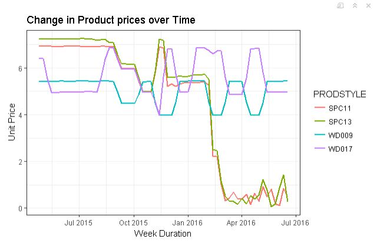
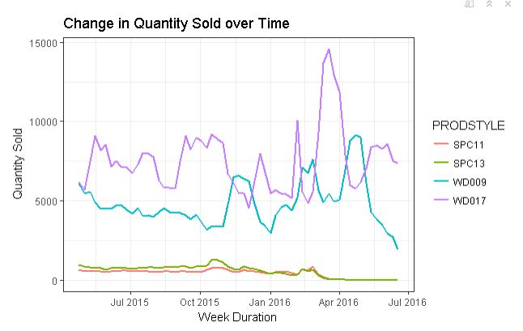

<h1>How I approached my Capstone Project</h1>

After 9 months of rigorous training and assignments, I entered my crucial and final phase in my PGPDM Data Science & Machine Learning course with Jigsaw Academy and The University of Chicago’s Graham school. My Capstone project is a real-time business problem of a leading cleaning brand manufacturer in USA, assigned by the industry partner. The problem statement was to identify the pricing dynamics and determine the price elasticity of the target brand based on customer segments and time period. Wow! Looks interesting!
First few questions in my mind: What this cleaning brand will do if I solve this? Where will they use this? Why they will be interested to understand this price movement? Who are the key stakeholders? How much benefit will they attain? And so on…
To clear the doubts and to find a way to solve this challenge, 
<h3>1.	Business Understanding:</h3> I took the first step to understand the business domain. My research with industry partner and webs sources led to very interesting insights about – 
(a) the relationship between a consumer product manufacturer and a retailer 
(b) importance in pricing correctly to increase revenue and margin 
(c) undisputable power of the retailer who determines the final price 
(d) how our cleaning brand manufacturer can influence the price by understanding the price elasticity of their products and 
(e) what key factors will determine the price elasticity

 I even signed up for a [Pricing Strategy course](https://www.coursera.org/learn/uva-darden-bcg-pricing-strategy-cost-economics) in Coursera to understand the details in-depth.

<h3>2.	Data Understanding:</h3> Once I understood the above, my next step was to look at the data that was provided to us. The data had 3 customer segments(retailers) with store level and state level weekly transactional data of target brand and its competitors. On doing preliminary descriptive statistics, I was able to grasp the level of data I had, the missing elements and the differences in the customer segments (each retailer were selling different SKUs of the target brand and having their own pricing strategy)

<h3>3.	Data Preparation:</h3> 
<b>(a)	Exploratory Data Analysis:</b> Here comes the most interesting part – slicing and dicing data through data manipulation and visualization. This is the stage where I understood which products do an exceptional and mediocre sales across states, stores, customer segments and time period. The below diagram explains how the product price and quantity sold have changed over time for one retailer. 
 

<b>(b)	Feature Engineering:</b> To build the model, I understood I need to engineer few variables like price of one product, week number and log transformations of few more variables to make them normally distributed. Well-engineered variables will always yield a better and accurate model!

<h3>4.	Modelling:</h3> The fancy stage in the entire Data Science process – building models. I was not fortunate enough to build advanced model as a statistical algorithm like linear regression only will help to solve the problem of determining elasticity of a product. Nevertheless, I was lucky to apply linear regression in-depth, avoiding over-fitting issues and learning more about the assumptions and interpretations of linear regression results (I believe this would be a strong foundation for building advanced models in future. The key thing to note is to solve a business problem with a more sophisticated and scalable algorithm than building advanced models that may not fit the business requirement). I estimated both price elasticity and cross-price elasticity of the target brand based on customer segments and time period to present a comparative picture.

As the linear regression helps to find the statistical relationship between variables, the price elasticity can be determined as:

                            Q = α + β1X1 + β2X2 + β3X3 + β4X4 + ei

Q - Tot. Quantity sold of the target product
 β1 - Coefficient/slope of the target product
 X1 - Price of the target product`	
 β2 - Coefficient/slope of the related product
 X2 - Price of the related product
 β3 - Coefficient/slope of the competitor product
 X3 - Price of the competitor product
 β4 - Coefficient/slope of Time period
 X4 - Time period

                       Price elasticity of Demand = Change in quantity (ΔQ) / Change in Price (ΔPX1)

<h3>5.	Evaluation:</h3> The key evaluation metric was RMSE or Root Mean Square Error value which needs to be as low as possible to determine the efficiency of the linear regression model. Also, I have considered MAE and predicted R2 scores as other key evaluation parameters.
Finally, what can be inferred from this exercise?  
  The target product got a price elasticity of -2.27. <b>An intuitive explanation will be - a 10% decrease in their price will lead to 22.7% increase in their demand.</b> If the retailer sells 1000 products at $5 each in a week, reducing the price by 10% i.e. keeping it at $4.5, the demand will increase to 1227 quantities. Subsequently the revenue in a week for the retailer will increase from $5000 to $5521.50. The cleaning brand manufacturer can use this information to influence the retailer and optimize the price to get more margin and market share for their product.
  To conclude, I have approached this entire project based on CRISP-DM Methodology which was the data analytics project framework of the PGPDM course. 
